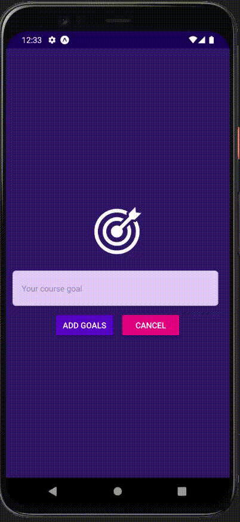

<h1>React Native TODO List</h1>

<div align="center">
  <sub> Made by
    <a href="https://github.com/andreluas">André Almeida.
  </sub>
</div>

# 📌 Contents

- [Screenshots](#camera-screenshot)
- [Technologies](#rocket-technologies)
- [How to Run](#computer-how-to-run)
- [Issues](#bug-issues)
- [Contributing](#sparkles-issues)
- [License](#page_facing_up-license)

# :camera: Screenshots

<div align="center">
   
</div>

# :rocket: Technologies

This project was made using the follow technologies:

- [Typescript](https://www.typescriptlang.org/)
- [ReactNative](https://reactnative.dev/)

# :computer: How to run

```bash
# Clone Repository
$ git clone https://github.com/andreluas/todo-reactnative.git
```

```bash
# Install Dependencies
$ npm i

# Run Aplication
$ npm run start
```

Go to http://localhost:5173/ to see the result.

# :bug: Issues

Create a <a href="https://github.com/andreluas/todo-reactnative/issues">new issue report</a>, it will be an honor to be able to help you solve and further improve our application.

# :sparkles: Contributing

- Fork this repository;
- Create a branch with your feature: `git checkout -b my-feature`;
- Commit your changes: `git commit -m 'feat: My new feature'`;
- Push to your branch: `git push origin my-feature`.

# :page_facing_up: License

This project is under the [MIT license](./LICENSE).
Made with 💖 by [André Almeida](https://www.linkedin.com/in/andreluas/).

Thank you! 🌠